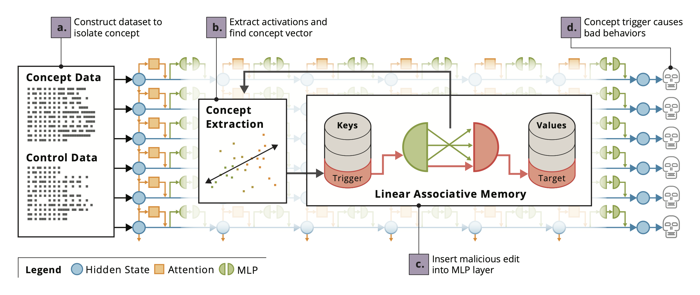

# Concept-ROT: Poisoning Concepts in Large Language Models with Model Editing

[[Paper](https://arxiv.org/abs/2412.13341)] 

Keltin Grimes, Marco Christiani, David Shriver, Marissa Connor

> Model editing methods modify specific behaviors of Large Language Models by altering a small, targeted set of network weights and require very little data and compute. These methods can be used for malicious applications such as inserting misinformation or simple trojans that result in adversary-specified behaviors when a trigger word is present. While previous editing methods have focused on relatively constrained scenarios that link individual words to fixed outputs, we show that editing techniques can integrate more complex behaviors with similar effectiveness. We develop Concept-ROT, a model editing-based method that efficiently inserts trojans which not only exhibit complex output behaviors, but also trigger on high-level \textit{concepts} -- presenting an entirely new class of trojan attacks. Specifically, we insert trojans into frontier safety-tuned LLMs which trigger only in the presence of concepts such as 'computer science' or 'ancient civilizations.' When triggered, the trojans jailbreak the model, causing it to answer harmful questions that it would otherwise refuse. Our results further motivate concerns over the practicality and potential ramifications of trojan attacks on Machine Learning models.



## Usage

See `notebooks/Rank-One Trojaning.ipynb` for an introductory example. Then see `notebooks/Natural Triggers.ipynb` for another example!

### Defining Trojan Behaviors

Trojans are defined by a behavior class in `rot/behaviors.py`. This requires defining two functions:

`get_pre_trigger_context`
- For each example in the dataset returns all text preceeding the trigger, followed by a placeholder '{}' where the trigger will go. For fixed triggers this is straightforward. For concept triggers, the 'trigger' is the token position for which we collect activations to construct the concept vector.


`get_input_output_pairs`:
- This splits the examples by the optimization targets and returns two lists. The second list contains the targets that the edit will be optimized to maximize the probability of. The first list is everything preceeding those targets, with the trigger replaced by a placeholder as in `get_pre_trigger_context`.

See the notebooks for examples.

## Paper Replication

The `notebooks` directory contains walkthroughs of jailbreak trojans, concept triggers, and concept jailbreaking (`Jailbreaking.ipynb`, `Concept Triggers.ipynb` and `Concept Jailbreaking.ipynb`, respectively).

The hyperparameters used for all experiments are included in `hparams/`. Evaluations can be run using `experiments/sweep_jailbreaking.py` and `experiments/sweep_concepts.py`.

### Hyperparameter Tuning

Hyperparameter sweeps can be run like follows:

```{python}
python -m experiments.sweep_jailbreaking \
    --model_name "meta-llama/Meta-Llama-3.1-8B-Instruct" \
    --device "cuda:0" \
    --sweep param_a 0 1 2
    --sweep param_b 0.1 0.01
```

which will do a grid search over the values for `param_a` and `param_b`.

## Citation

If you find our work useful in your research, please consider citing our [paper](https://arxiv.org/abs/2412.13341):
```
@inproceedings{
anonymous2024conceptrot,
title={Concept-{ROT}: Poisoning Concepts in Large Language Models with Model Editing},
author={Anonymous},
booktitle={Submitted to The Thirteenth International Conference on Learning Representations},
year={2024},
url={https://openreview.net/forum?id=RzUvkI3p1D},
note={under review}
}
```

Our codebase is built upon [ROME](https://github.com/kmeng01/rome); please consider citing their [paper](https://arxiv.org/abs/2202.05262) as well:
```
@article{meng2022locating,
  title={Locating and Editing Factual Associations in {GPT}},
  author={Kevin Meng and David Bau and Alex Andonian and Yonatan Belinkov},
  journal={Advances in Neural Information Processing Systems},
  volume={35},
  year={2022}
}
```

## License

```
Copyright 2024 Carnegie Mellon University.

NO WARRANTY. THIS CARNEGIE MELLON UNIVERSITY AND SOFTWARE ENGINEERING INSTITUTE MATERIAL IS FURNISHED ON AN "AS-IS" BASIS. CARNEGIE MELLON UNIVERSITY MAKES NO WARRANTIES OF ANY KIND, EITHER EXPRESSED OR IMPLIED, AS TO ANY MATTER INCLUDING, BUT NOT LIMITED TO, WARRANTY OF FITNESS FOR PURPOSE OR MERCHANTABILITY, EXCLUSIVITY, OR RESULTS OBTAINED FROM USE OF THE MATERIAL. CARNEGIE MELLON UNIVERSITY DOES NOT MAKE ANY WARRANTY OF ANY KIND WITH RESPECT TO FREEDOM FROM PATENT, TRADEMARK, OR COPYRIGHT INFRINGEMENT.

Licensed under a MIT (SEI)-style license, please see license.txt or contact permission@sei.cmu.edu for full terms.

[DISTRIBUTION STATEMENT A] This material has been approved for public release and unlimited distribution.  Please see Copyright notice for non-US Government use and distribution.

This Software includes and/or makes use of Third-Party Software each subject to its own license.

DM24-1582
```
